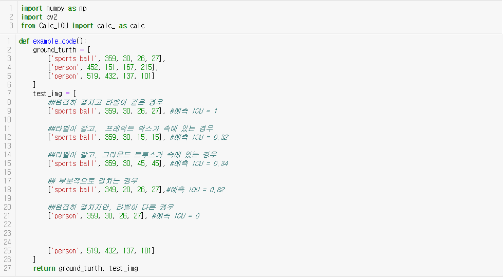
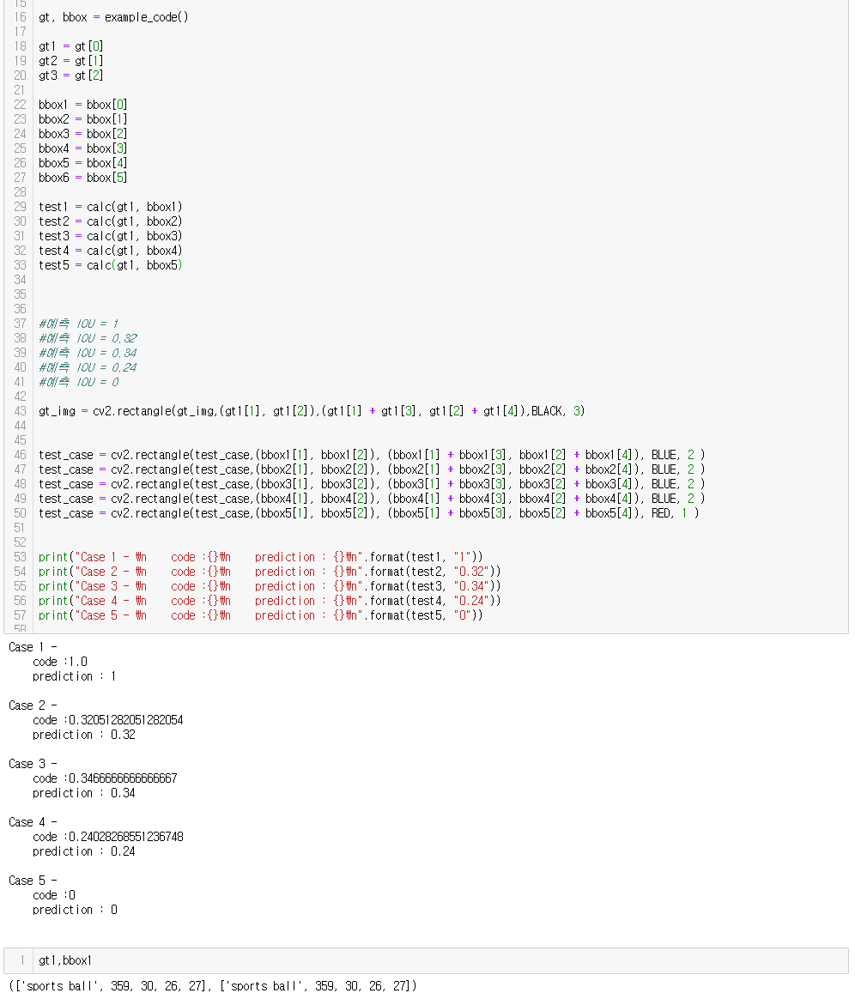

# Calc_IOU
Calculate IOU own my code

# Enviroment

python 3.6.7
numpy 1.15.2

# How to use it

This code was written in Python 3.6

It is a code that has a simple function.

To use it, first import the code,
You can enter both boxes.
Each box should consist of [Label, Top left X, Top left Y, Width, Height] in list form.

# Example

